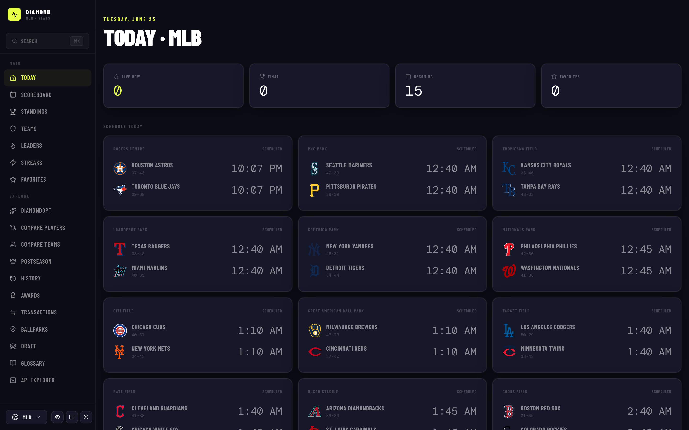
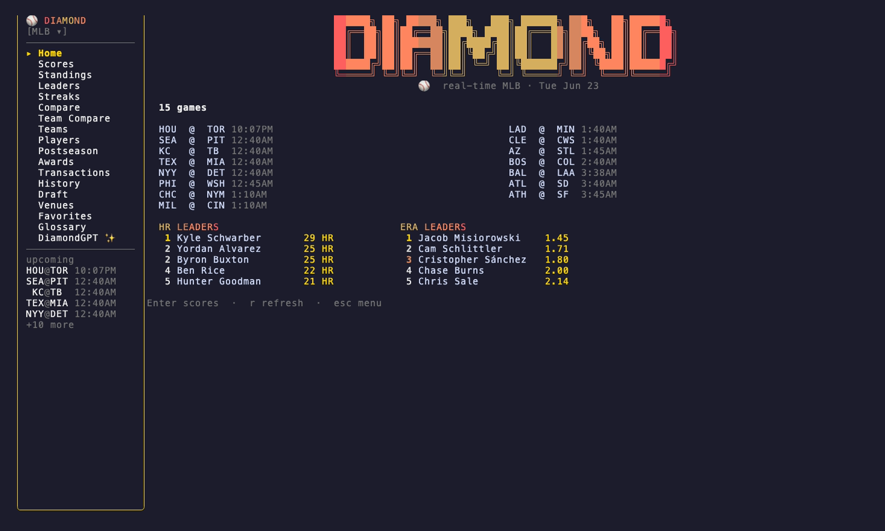
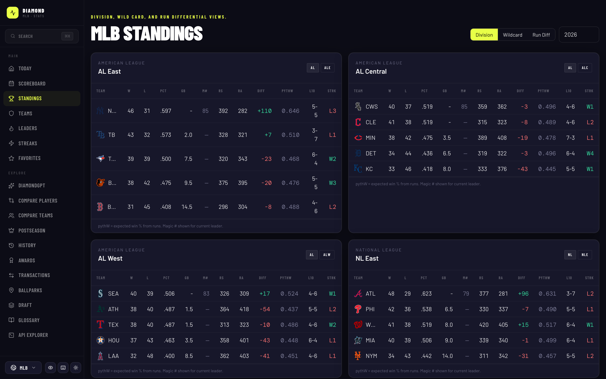
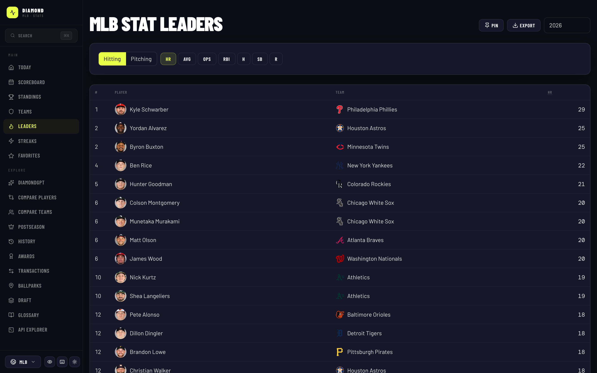
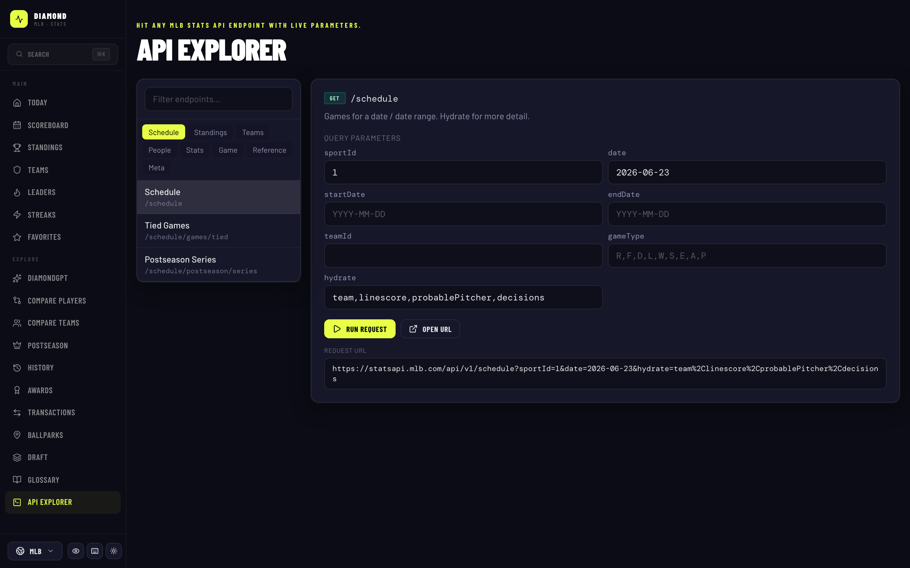
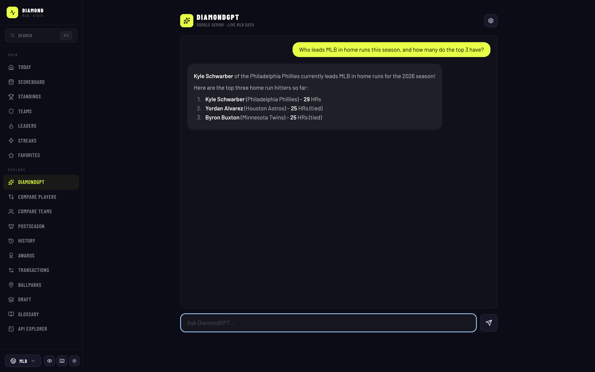
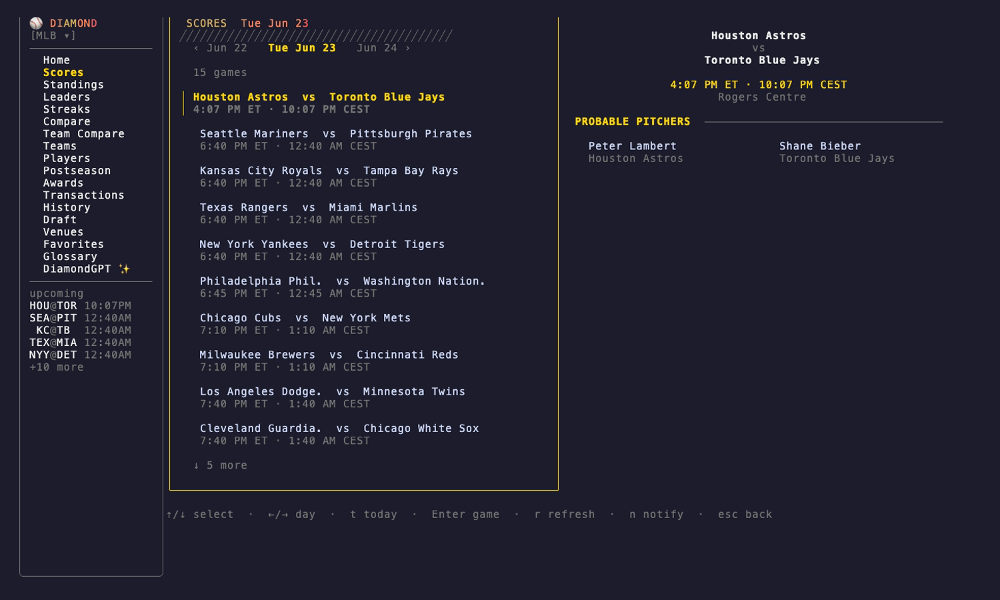
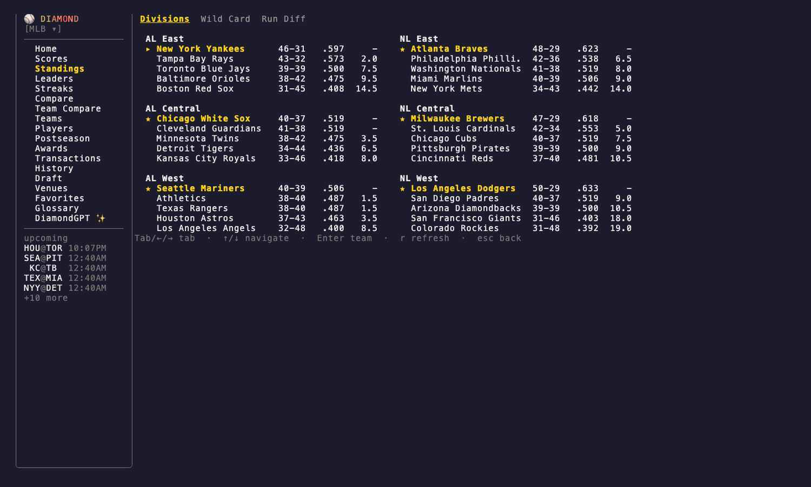
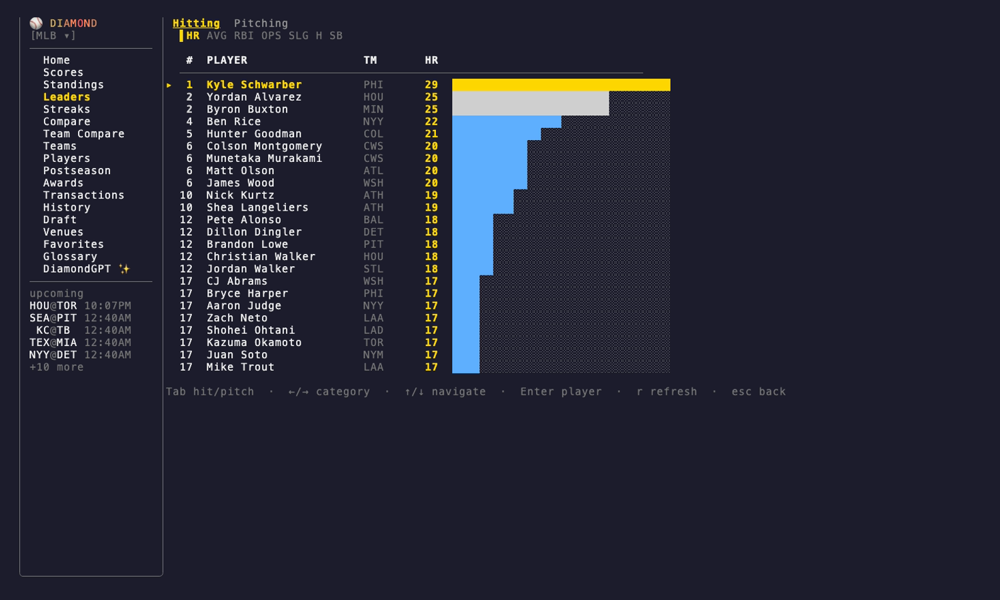
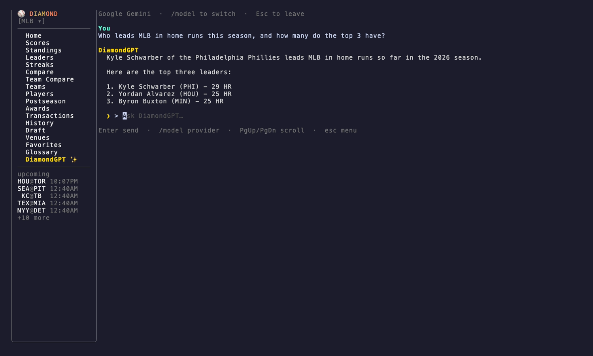

# ⚾ Diamond — MLB Stats, Everywhere

Explore the public **MLB Stats API** (`statsapi.mlb.com`) from a beautiful terminal
app or a full-featured web app — both backed by **DiamondGPT**, an MLB-aware AI
assistant with live data tool-calling.

This is a monorepo with two front ends sharing the same idea:

- **[`cli/`](cli/)** — a Go terminal app (`diamond`) built with Bubble Tea.
- **[`web/`](web/)** — a Vite + React web app with a Genkit (Node) backend.

No API key is required for MLB data — the MLB Stats API is public and CORS-friendly.

**🌐 [diamond.xavidop.me](https://diamond.xavidop.me)** — landing page  ·  **🖥️ [diamondapp.xavidop.me](https://diamondapp.xavidop.me)** — live web app  ·  **📦 `brew install xavidop/tap/diamond`** — CLI

<table>
  <tr>
    <td width="50%"></td>
    <td width="50%"></td>
  </tr>
  <tr>
    <td align="center"><em>Web app</em></td>
    <td align="center"><em>Terminal app</em></td>
  </tr>
</table>

## Table of Contents

- [⚾ Diamond — MLB Stats, Everywhere](#-diamond--mlb-stats-everywhere)
  - [Table of Contents](#table-of-contents)
  - [Features](#features)
  - [Screenshots](#screenshots)
    - [Web](#web)
    - [CLI](#cli)
  - [Installation](#installation)
    - [CLI — Homebrew](#cli--homebrew)
    - [CLI — Docker](#cli--docker)
    - [CLI — go install](#cli--go-install)
    - [CLI — from source](#cli--from-source)
    - [Web — Docker](#web--docker)
    - [Web — from source](#web--from-source)
  - [CLI](#cli-1)
    - [Commands](#commands)
    - [Interactive TUI](#interactive-tui)
    - [Favorites](#favorites)
    - [MCP server](#mcp-server)
  - [Web](#web-1)
  - [DiamondGPT](#diamondgpt)
  - [Releases](#releases)
  - [Notes \& disclaimer](#notes--disclaimer)

## Features

- **Live scoreboard** — live & scheduled games with auto-refresh, date picker, linescores, probable pitchers.
- **Standings** — division and wild-card standings by league and season.
- **Teams** — every club with logos, league/division, roster, and season stats.
- **Player profiles** — bio, headshot, career totals, year-by-year tables, AVG/ERA trend charts, splits, and game logs.
- **Game detail** — live linescore, batter/pitcher boxscores, and auto-refreshing play-by-play.
- **Stat leaders** — hitting & pitching leaders for any season with a category switcher.
- **More in the TUI** — streaks, player/team comparisons, postseason, awards, transactions, history, draft, venues, and a stats glossary.
- **API Explorer** (web) — call every MLB Stats API endpoint with a dynamic UI and raw JSON viewer.
- **DiamondGPT** — chat with an AI that calls 18 live MLB data tools (Gemini, Claude, or OpenAI).

## Screenshots

### Web

<table>
  <tr>
    <td width="50%"></td>
    <td width="50%"></td>
  </tr>
  <tr>
    <td align="center"><em>Today dashboard</em></td>
    <td align="center"><em>Standings</em></td>
  </tr>
  <tr>
    <td width="50%"></td>
    <td width="50%"></td>
  </tr>
  <tr>
    <td align="center"><em>Stat leaders</em></td>
    <td align="center"><em>API Explorer</em></td>
  </tr>
  <tr>
    <td colspan="2"></td>
  </tr>
  <tr>
    <td colspan="2" align="center"><em>DiamondGPT — ask in plain English, answered with live data</em></td>
  </tr>
</table>

### CLI

<table>
  <tr>
    <td width="50%"></td>
    <td width="50%"></td>
  </tr>
  <tr>
    <td align="center"><em>Interactive menu</em></td>
    <td align="center"><em>Scoreboard (<code>diamond scores</code>)</em></td>
  </tr>
  <tr>
    <td width="50%"></td>
    <td width="50%"></td>
  </tr>
  <tr>
    <td align="center"><em>Standings (<code>diamond standings</code>)</em></td>
    <td align="center"><em>Leaders (<code>diamond leaders</code>)</em></td>
  </tr>
  <tr>
    <td colspan="2"></td>
  </tr>
  <tr>
    <td colspan="2" align="center"><em>DiamondGPT ✨ in the terminal — live data, in your shell</em></td>
  </tr>
</table>

## Installation

### CLI — Homebrew

```bash
brew install xavidop/tap/diamond
diamond
```

### CLI — Docker

```bash
docker run --rm -it ghcr.io/xavidop/diamond:latest
# or a specific subcommand:
docker run --rm -it ghcr.io/xavidop/diamond:latest scores
```

### CLI — go install

```bash
go install github.com/xavidop/diamond/cli@latest
```

### CLI — from source

```bash
cd cli
go build -o diamond .
./diamond
```

### Web — Docker

```bash
docker run --rm -p 8080:8080 \
  -e ANTHROPIC_API_KEY=sk-... \
  ghcr.io/xavidop/diamond-web:latest
# open http://localhost:8080
```

The web image bundles the built frontend and the Genkit/Express server. A
DiamondGPT API key is optional — you can also paste a provider key in the UI.

### Web — from source

```bash
cd web
npm install
npm run dev         # frontend only        → http://localhost:5173
npm run dev:server  # DiamondGPT backend    → http://localhost:8080
```

## CLI

The Go CLI (`diamond`) renders everything as a rich Bubble Tea TUI. Running it
with no arguments opens the interactive menu; the subcommands jump straight to a
specific view.

### Commands

| Command | Description | Flags / args |
| --- | --- | --- |
| `diamond` | Interactive TUI menu | — |
| `diamond scores` | Today's scoreboard | `--date YYYY-MM-DD` |
| `diamond game <gamePk>` | Live game detail | `<gamePk>` (required) |
| `diamond standings` | Division standings | `--season YYYY` |
| `diamond leaders` | Stat leaders | `--group hitting\|pitching` |
| `diamond team [name]` | Team roster and stats | `[name]` (optional search) |
| `diamond player [name]` | Player profile and stats | `[name]` (optional search) |
| `diamond mcp` | Run an MCP server exposing the MLB tools | `--name`, `--server-version` |
| `diamond --version` | Print version, commit, and build date | — |

### Interactive TUI

Run `diamond` with no arguments to launch the menu. The sidebar (with a live-game
count that refreshes every 30s) gives you: Home, Scores, Standings, Leaders,
Streaks, Compare, Team Compare, Teams, Players, Postseason, Awards, Transactions,
History, Draft, Venues, Favorites, Glossary, and **DiamondGPT ✨**. Navigate with
the arrow keys, `Enter` to drill in, and `r` to refresh.

### Favorites

Favorite teams and players are persisted to
`$XDG_CONFIG_HOME/diamond/favorites.json` (defaults to
`~/.config/diamond/favorites.json`) and managed from the **Favorites** view.

### MCP server

`diamond mcp` runs a [Model Context Protocol](https://modelcontextprotocol.io)
stdio server exposing all 18 MLB data tools to any MCP-capable client.

```bash
diamond mcp --name diamond-mlb --server-version 1.0.0
```

## Web

The web app is built with **Vite + React + TypeScript + Tailwind + TanStack Query
+ Recharts**, with a **Genkit (Node) + Express** backend that powers DiamondGPT.
Highlights:

- **Scoreboard** with auto-refresh, date picker, linescores, and probable pitchers.
- **Standings**, **Teams** (with roster + season stats), and **Player profiles**
  (career totals, year-by-year tables, AVG/ERA trend charts).
- **Game detail** with live linescore, boxscores, and auto-refreshing play-by-play.
- **Stat Leaders** with a category switcher.
- **API Explorer** — a dynamic UI to call every MLB Stats API endpoint, with
  path/query params, a raw JSON viewer, copy button, and open-in-tab link.
- **Player search** in the header.

See [`web/README.md`](web/README.md) for more.

## DiamondGPT

DiamondGPT is an MLB-aware AI assistant (built with [Genkit](https://genkit.dev))
that answers baseball questions by calling 18 live MLB data tools — schedules,
standings, leaders, player/team stats, splits, game logs, awards, postseason,
draft, venues, win probability, and more.

It runs in both front ends (the **DiamondGPT ✨** view in the CLI, and in the web
app). Pick any one provider by setting its API key:

| Provider | Env var | Default model |
| --- | --- | --- |
| Google Gemini | `GEMINI_API_KEY` | `googleai/gemini-flash-latest` |
| Anthropic Claude | `ANTHROPIC_API_KEY` | `anthropic/claude-sonnet-4-6` |
| OpenAI | `OPENAI_API_KEY` | `openai/gpt-4.1-mini` |

In the web UI you can also paste a key directly. In the CLI chat, use `/model`,
`/provider`, or `/switch` to change providers mid-conversation.

## Website

The landing page lives in [`site/`](site/) — an [Astro](https://astro.build) site
deployed to **[diamond.xavidop.me](https://diamond.xavidop.me)** via GitHub Pages
([`.github/workflows/deploy-site.yml`](.github/workflows/deploy-site.yml)). It pulls
its screenshots from [`docs/screenshots/`](docs/screenshots/) at build time.

```bash
cd site
npm install
npm run dev      # http://localhost:4321
npm run build    # static output in site/dist
```

> First-time setup: in the repo **Settings → Pages**, set the build source to
> **GitHub Actions**, and point the `diamond.xavidop.me` DNS record at GitHub Pages.

## Releases

Releases are automated with **conventional commits → semantic-release → GoReleaser**:

- Merging a `feat:`/`fix:` commit to `main` cuts a new version (`vX.Y.Z`),
  updates `CHANGELOG.md`, and tags the release.
- GoReleaser then builds the CLI for linux/darwin/windows × amd64/arm64,
  publishes the Homebrew cask to [`xavidop/homebrew-tap`](https://github.com/xavidop/homebrew-tap),
  and pushes Docker images:
  - CLI → `ghcr.io/xavidop/diamond`
  - Web → `ghcr.io/xavidop/diamond-web`

See [docs/superpowers/specs/2026-06-23-release-pipeline-design.md](docs/superpowers/specs/2026-06-23-release-pipeline-design.md)
for the pipeline design.

## Notes & disclaimer

The MLB Stats API is **public** and CORS-friendly — no API key is required for
stats. This project is not affiliated with MLB. All data © MLB Advanced Media.
